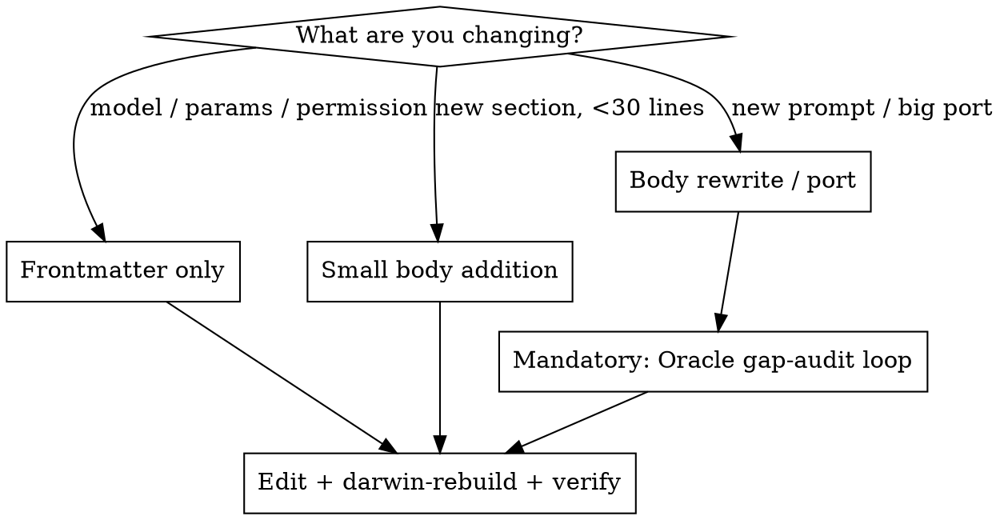

# Updating OpenCode Agents

Safely edit agent prompts, models, parameters, and permissions in `config/opencode/agents/` without re-learning the lessons that cost hours last time.

## The One Thing You Must Know

**Agent `.md` body content REPLACES the provider base prompt.** It does not extend or merge. If an agent file has any body content, the provider base prompt (`anthropic.txt`, `gpt.txt`, `gemini.txt`) is not used.

This is the root of most trouble. A 13-line custom body does not "inherit" the base prompt's 100+ lines of tool guidance, TodoWrite emphasis, parallelism rules, code-reference format, etc. — those are gone.

**Verify this is still true before a major rewrite.** OpenCode may change its assembly semantics:

```bash
# Find where the system prompt is assembled
rg -n "system" ~/github/opencode/packages/opencode/src/session/llm.ts
rg -n "prompt" ~/github/opencode/packages/opencode/src/session/
```

If the replace-vs-extend behavior has changed, the rest of this skill may need adjusting.

## Sources of Truth

| Source | Where | When it matters |
|---|---|---|
| OpenCode base prompts | `~/github/opencode/packages/opencode/src/session/prompt/*.txt` | Every body rewrite — this is what you're replacing |
| OpenCode assembly logic | `~/github/opencode/packages/opencode/src/session/llm.ts` + `provider/transform.ts` | Option defaults (e.g. GPT `textVerbosity`), replace/extend semantics, permission behaviour |
| OpenCode tool registry | `~/github/opencode/packages/opencode/src/tool/registry.ts` | Which tools each model family actually gets (e.g. `apply_patch` vs `edit`/`write`), task permission evaluation |
| OpenCode native agents | `~/github/opencode/packages/opencode/src/agent/agent.ts` | Built-in subagents (`general`, `explore`, etc.) that appear in Task menus alongside your custom roster |
| Global OpenCode config | `config/opencode/opencode.json` | Global permission defaults, disabled agents, bash allowlists — these interact with per-agent frontmatter |
| Our agents | `config/opencode/agents/*.md` | Current state — the thing you're editing |
| Amp | `~/.amp/bin/amp` binary + `ampcode.com/models` + `ampcode.com/chronicle` | Production-hardened prompt patterns and model choices |
| oh-my-openagent | `~/github/oh-my-openagent/src/agents/` | Opinionated agent role definitions (Oracle, Hephaestus, etc.) |

**Propagation flow:** Use `auditing-agent-sources` skill to surface deltas from these upstream sources. Use this skill to apply them.

**The whole picture includes four layers.** A correct change usually touches at least two:

1. **Agent frontmatter** — model, params, per-agent permissions
2. **Agent body** — prompt text
3. **Global config** (`opencode.json`) — permission defaults, disabled agents (`plan`, `explore`), bash allowlists
4. **OpenCode internals** — tool registry, native agents, assembly logic (you read these; you don't edit them)

A permission change in (1) can be undone or reinforced by (3). A prompt change in (2) can mismatch a tool exposed in (4). Always look at all four before shipping.

## Decide Scope First



Frontmatter-only and small additions are low-risk. Body rewrites must go through the gap-audit loop — the base prompt you replace has 100+ lines of behaviour that agents silently lose.

## The Oracle Gap-Audit Loop (for body rewrites)

Skipping this cost four review rounds last time. Do not skip it.

1. **Stage, don't edit live.** Create a staging directory in the vault: `~/Documents/notes/Engineering/Plans/nix-darwin/staging/YYYY-MM-DD-<topic>/`. Write every proposed new body there, one file per agent. Live `config/opencode/agents/` stays untouched until the whole batch passes review. Staging belongs outside the nix-darwin repo so in-progress drafts never get half-committed (see the global `Superpowers Plan Storage` rule in `config/opencode/AGENTS.md`).
2. **Per-agent gap-audit.** For each staged draft, dispatch Oracle with: the draft + the base prompt it replaces + the current live agent file + any upstream source you're porting from. Fix every gap. Re-dispatch. Repeat until no findings on that agent.
3. **Final holistic pass.** After per-agent passes are clean, run one more Oracle pass covering the whole staged set: prompts + permissions + parameters + `opencode.json` context together. Per-agent passes miss cross-cutting issues — model↔tool mismatches (e.g. `apply_patch` vs `edit`), privilege-escalation paths via `task` dispatch, `large.md` missing from the staging dir, parameter↔prompt tensions. The holistic pass is where those surface.
4. **Deploy as a single commit.** Once the holistic pass is clean, copy the entire staging directory to `config/opencode/agents/`, then `darwin-rebuild` and verify. One commit, reversible.

Ready-to-adapt Oracle prompt: see `oracle-gap-audit-prompt.md` in this skill directory. The template covers both per-agent and holistic passes.

## Anti-Boxing Principle

**Prompts describe what the agent DOES. They do not duplicate permission-system restrictions in prose.**

The permission system (`edit: deny`, `task: deny` in frontmatter) is the actual enforcement. Prose phrasing like "you do not execute" or "you are read-only" is ambiguous — models read "do not execute" as "don't run any commands" and become hesitant to use Bash/Grep/git for context-gathering.

Good: *"You analyze and advise. You do not make code changes, but you actively use Read, Grep, Glob, and git commands to gather context."*

Bad: *"You advise. You do not execute."*

Similarly: "read-only" means "don't modify the user's project files" — NOT "don't clone temp repos, don't write to `/tmp`". If an agent can do its job better by cloning a repo locally and grepping it, let it. Optimize for functionality over tidy role definitions.

## Known Gotchas — Check These Are Still True

These were real in April 2026. Re-verify against current OpenCode source; they may have been fixed.

- **Empty-body fallback:** An agent file with only frontmatter falls back to the raw provider prompt — NOT to any other agent's prompt. If you want `large.md` to share `build.md`'s body, mirror it explicitly. Re-verify: compare `large.md` vs `build.md` line counts.

- **Model-specific tool swaps.** OpenCode picks different file-editing tools based on the model. Last known rule (re-verify in `tool/registry.ts`): GPT models that aren't `oss` and aren't `gpt-4` get `apply_patch`; every other model gets `edit` + `write`. So prompt text referring to "the Edit tool" fails for a GPT-5.x agent. When porting a prompt between model families, translate tool names to match what the target model actually receives. Check with:
  ```bash
  rg -n "apply_patch|EditTool|WriteTool" ~/github/opencode/packages/opencode/src/tool/registry.ts
  ```

- **Provider option defaults may undercut you.** OpenCode has historically forced low-verbosity defaults for some GPT-5.x variants at the provider-transform layer. Check `provider/transform.ts` for option normalisation. If you want high verbosity on a GPT agent, set `options.textVerbosity: high` explicitly — do not trust the model to inherit it.

- **Parameter↔prompt tension.** Don't set `textVerbosity: high` on an agent whose prompt also imposes strict brevity caps ("≤3 bullets", "2-3 sentences"). The two directives fight and behaviour becomes unpredictable. Pick one: loose params + tight prompt, or tight params + flexible prompt.

- **`task` permission is per-target, not all-or-nothing.** `Permission.evaluate("task", <target-agent-name>, ...)` means you can allow dispatch of specific subagents only. The full-lockout + allowlist pattern:
  ```yaml
  permission:
    edit: deny
    task:
      "*": deny
      research: allow
  ```
  This keeps the Task menu small (prevents distraction) AND prevents privilege escalation into edit-capable agents.

- **Native subagents exist alongside your custom roster.** OpenCode ships built-in subagents (`general`, `explore`, etc.) defined in `agent/agent.ts`. By default they inherit global permissions and can edit files. If you leave `task` as default-allow on an advisory agent, its dispatch menu includes `general` — a distraction surface and a privilege-escalation path. Always pair `task: allow` with an explicit allowlist, OR disable the native agents globally in `opencode.json` (the `plan` and `explore` agents are already disabled there as precedent).

- **`edit: deny` is not a sandbox.** It blocks the `edit`/`write`/`apply_patch` tools but `bash` can still create files. "Read-only" agents enforce this by prompt discipline, not isolation. Don't trust `edit: deny` to prevent a bash-enabled agent from writing — use the permission system AND a clear prompt.

- **Permission syntax variants.** `task: deny`, `task: { "*": deny }`, and the full allowlist form all appear in docs/examples. Permission evaluation is last-match-wins (see `permission/evaluate.ts`). Validate your exact syntax against the current schema before shipping.

## Deployment

For multi-file rewrites, deploy from the staging directory in one atomic step. For single-file frontmatter edits, edit `config/opencode/agents/` directly.

```bash
# 1. (Multi-file rewrite only) Copy staging → live in one commit
cp ~/Documents/notes/Engineering/Plans/nix-darwin/staging/YYYY-MM-DD-<topic>/*.md config/opencode/agents/
git add config/opencode/agents/ && git commit -m "feat: <description>"

# 2. Rebuild — the mkOutOfStoreSymlink in home/opencode.nix picks up edits immediately
#    (Run without sudo; darwin will prompt for a password if needed.)
darwin-rebuild switch --flake ~/.config/nix-darwin

# 3. Verify the symlinked files match what you shipped
ls -la ~/.config/opencode/agents/
wc -l ~/.config/opencode/agents/*.md
head -10 ~/.config/opencode/agents/<agent>.md

# 4. Open OpenCode, run /agents, confirm models and descriptions look right
```

If the rebuild does not pick up changes, check that `home/opencode.nix` has `xdg.configFile."opencode/agents".source = mkOutOfStoreSymlink ...` (not `force = true;` without mkOutOfStoreSymlink, which would copy instead of link).

**After deployment:** delete the staging directory or move it under a `completed/` subdir. Leaving stale drafts around invites confusion on the next update.

## Common Mistakes

| Mistake | Why it hurts | Fix |
|---|---|---|
| Editing body without gap-audit | Silent loss of 100+ lines of base-prompt behaviour | Use Oracle loop for any body rewrite |
| Stopping after per-agent passes | Cross-cutting issues (tool mismatches, task escalation, missing files) only surface when reviewing the whole system together | Always run the holistic final pass after per-agent passes clear |
| Editing live agents during iteration | Hard to roll back mid-rewrite; agents run inconsistent drafts | Stage all drafts under `~/Documents/notes/Engineering/Plans/nix-darwin/staging/` first; deploy only after holistic pass |
| Claiming "no changes needed" without auditing | Research/librarian were both flagged unchanged and had real gaps | Every agent in a rewrite gets its own Oracle pass |
| Prompt says "Edit tool" but agent gets `apply_patch` | Model tries to call a tool that doesn't exist for its family | Match prompt tool names to what `tool/registry.ts` actually exposes for that model |
| Leaving stale "override the base prompt" wording after rewrite | Base prompt is gone once body exists — the reference is meaningless | Self-audit step: grep your draft for "base prompt", "override", "inherit from" after writing |
| Unlocking `task` without target allowlist | Dispatch menu exposes `general` (edit-capable) — distraction + privilege escalation | Always pair `task: allow` with `"*": deny` + explicit allowlist |
| Duplicating permission rules in prose | Suppresses tool use; contradicts frontmatter | Prose describes what agent DOES; permission enforces DON'T |
| Treating `edit: deny` as a sandbox | Bash can still write files | Use permission system AND clear prompt; don't rely on either alone |
| Pinning exact model strings in skill docs | Rots on every model bump | Grep live agent files for current state |
| Copying symbol names or line numbers from upstream | Minified names / line numbers drift | Use grep/discovery recipes, not literals |
| Skipping darwin-rebuild verification | Changes live in repo but agent still runs old prompt | Always rebuild + `ls -la ~/.config/opencode/agents/` |

## Related Skills

- **`auditing-agent-sources`** — surfaces what changed upstream in Amp / OpenCode / OMO. Usually the trigger for using this skill.
- **`superpowers:brainstorming`** and **`superpowers:writing-plans`** — for large rewrites, run brainstorming before drafting and writing-plans before executing.
- **`superpowers:subagent-driven-development`** — for multi-agent rewrites, dispatch one subagent per agent file after the gap-audit loop approves the drafts.
