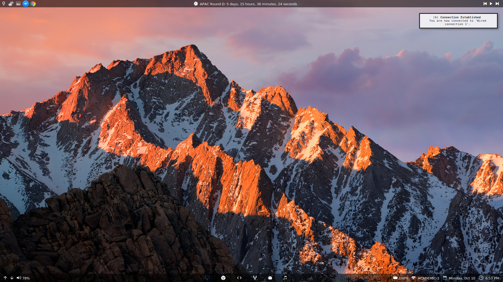

# My dotfiles

## All essential dotfiles for my Arch Linux installation.
Includes my setup files for:
- zsh
- i3
- Lemonbar
- Custom lockscreen
- Screen layout
- mpd / mopidy / ncmpcpp
- terminator
- stalonetray

## Screenshot:

