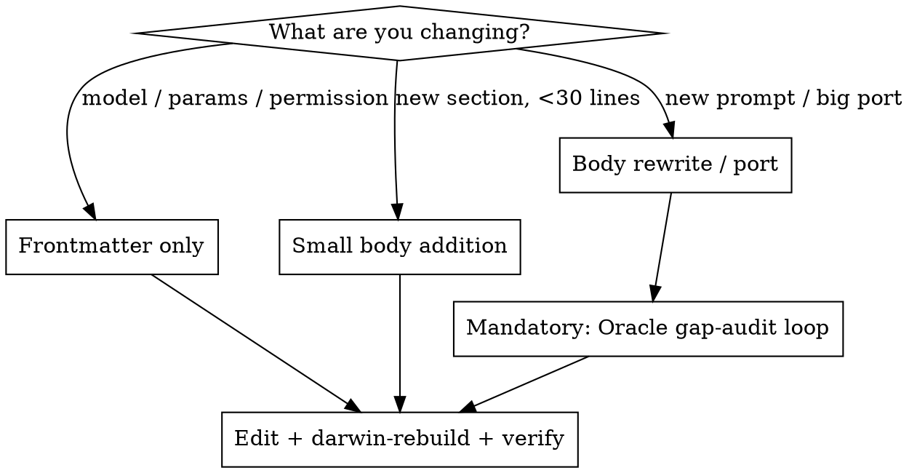

# Updating OpenCode Agents

Safely edit agent prompts, models, parameters, and permissions in `config/opencode/agents/` without re-learning the lessons that cost hours last time.

## The One Thing You Must Know

**Agent `.md` body content REPLACES the provider base prompt.** It does not extend or merge. If an agent file has any body content, the provider base prompt (`anthropic.txt`, `gpt.txt`, `gemini.txt`) is not used.

This is the root of most trouble. A 13-line custom body does not "inherit" the base prompt's 100+ lines of tool guidance, TodoWrite emphasis, parallelism rules, code-reference format, etc. — those are gone.

**Verify this is still true before a major rewrite.** OpenCode may change its assembly semantics:

```bash
# Find where the system prompt is assembled
rg -n "system" ~/github/opencode/packages/opencode/src/session/llm.ts
rg -n "prompt" ~/github/opencode/packages/opencode/src/session/
```

If the replace-vs-extend behavior has changed, the rest of this skill may need adjusting.

## Sources of Truth

| Source | Where | When it matters |
|---|---|---|
| OpenCode base prompts | `~/github/opencode/packages/opencode/src/session/prompt/*.txt` | Every body rewrite — this is what you're replacing |
| OpenCode assembly logic | `~/github/opencode/packages/opencode/src/session/llm.ts` + `provider/transform.ts` | Option defaults (e.g. GPT `textVerbosity`), replace/extend semantics, permission behaviour |
| Amp | `~/.amp/bin/amp` binary + `ampcode.com/models` + `ampcode.com/chronicle` | Production-hardened prompt patterns and model choices |
| oh-my-openagent | `~/github/oh-my-openagent/src/agents/` | Opinionated agent role definitions (Oracle, Hephaestus, etc.) |
| Our agents | `config/opencode/agents/*.md` | Current state — the thing you're editing |

**Propagation flow:** Use `auditing-agent-sources` skill to surface deltas from these upstream sources. Use this skill to apply them.

## Decide Scope First



Frontmatter-only and small additions are low-risk. Body rewrites must go through the gap-audit loop — the base prompt you replace has 100+ lines of behaviour that agents silently lose.

## The Oracle Gap-Audit Loop (for body rewrites)

Skipping this cost four review rounds last time. Do not skip it.

1. Draft the proposed new body. Save to a scratch file under `docs/superpowers/plans/` — do not edit the live agent yet.
2. Dispatch the Oracle with the draft + the base prompt it replaces + the current agent file + any upstream source you're porting from.
3. Fix every gap Oracle reports.
4. Re-dispatch Oracle. Repeat until no remaining gaps.
5. Only then apply to `config/opencode/agents/`.

Ready-to-adapt Oracle prompt: see `oracle-gap-audit-prompt.md` in this skill directory.

## Anti-Boxing Principle

**Prompts describe what the agent DOES. They do not duplicate permission-system restrictions in prose.**

The permission system (`edit: deny`, `task: deny` in frontmatter) is the actual enforcement. Prose phrasing like "you do not execute" or "you are read-only" is ambiguous — models read "do not execute" as "don't run any commands" and become hesitant to use Bash/Grep/git for context-gathering.

Good: *"You analyze and advise. You do not make code changes, but you actively use Read, Grep, Glob, and git commands to gather context."*

Bad: *"You advise. You do not execute."*

Similarly: "read-only" means "don't modify the user's project files" — NOT "don't clone temp repos, don't write to `/tmp`". If an agent can do its job better by cloning a repo locally and grepping it, let it. Optimize for functionality over tidy role definitions.

## Known Gotchas — Check These Are Still True

These were real in April 2026. Re-verify against current OpenCode source; they may have been fixed.

- **Empty-body fallback:** An agent file with only frontmatter falls back to the raw provider prompt — NOT to any other agent's prompt. If you want `large.md` to share `build.md`'s body, mirror it explicitly. Re-verify: compare `large.md` vs `build.md` line counts.
- **Provider option defaults may undercut you:** OpenCode has historically forced low-verbosity defaults for some GPT-5.x variants. Check `provider/transform.ts` for option normalisation. If you want high verbosity on a GPT agent, set `options.textVerbosity: high` explicitly — do not trust the model to inherit it.
- **`apply_patch` tool from GPT base prompts does not exist in OpenCode.** If you port GPT prompt content that references it, substitute OpenCode's `edit` / `write` tools.
- **Permission syntax variants:** `task: deny` and `task: { "*": deny }` have both appeared in examples. Check current OpenCode config schema before shipping a permission change.

## Deployment

```bash
# 1. Apply changes (they land in config/opencode/agents/ in this repo)
# 2. Rebuild — the mkOutOfStoreSymlink in home/opencode.nix picks up edits immediately
darwin-rebuild switch --flake ~/.config/nix-darwin

# 3. Verify the symlinked files match what you wrote
ls -la ~/.config/opencode/agents/
wc -l ~/.config/opencode/agents/*.md
head -10 ~/.config/opencode/agents/<agent>.md

# 4. Open OpenCode, run /agents, confirm models and descriptions look right
```

If the rebuild does not pick up changes, check that `home/opencode.nix` has `xdg.configFile."opencode/agents".source = mkOutOfStoreSymlink ...` (not `force = true;` without mkOutOfStoreSymlink, which would copy instead of link).

## Common Mistakes

| Mistake | Why it hurts | Fix |
|---|---|---|
| Editing body without gap-audit | Silent loss of 100+ lines of base-prompt behaviour | Use Oracle loop for any body rewrite |
| Stopping after one Oracle pass | First pass finds structural gaps; wording and contradictions surface in pass 2+ | Iterate until Oracle reports no findings |
| Claiming "no changes needed" without auditing | Research/librarian were both flagged unchanged and had real gaps | Every agent in a rewrite gets its own Oracle pass |
| Duplicating permission rules in prose | Suppresses tool use; contradicts frontmatter | Prose describes what agent DOES; permission enforces DON'T |
| Pinning exact model strings in skill docs | Rots on every model bump | Grep live agent files for current state |
| Copying symbol names or line numbers from upstream | Minified names / line numbers drift | Use grep/discovery recipes, not literals |
| Skipping darwin-rebuild verification | Changes live in repo but agent still runs old prompt | Always rebuild + `ls -la ~/.config/opencode/agents/` |

## Related Skills

- **`auditing-agent-sources`** — surfaces what changed upstream in Amp / OpenCode / OMO. Usually the trigger for using this skill.
- **`superpowers:brainstorming`** and **`superpowers:writing-plans`** — for large rewrites, run brainstorming before drafting and writing-plans before executing.
- **`superpowers:subagent-driven-development`** — for multi-agent rewrites, dispatch one subagent per agent file after the gap-audit loop approves the drafts.
